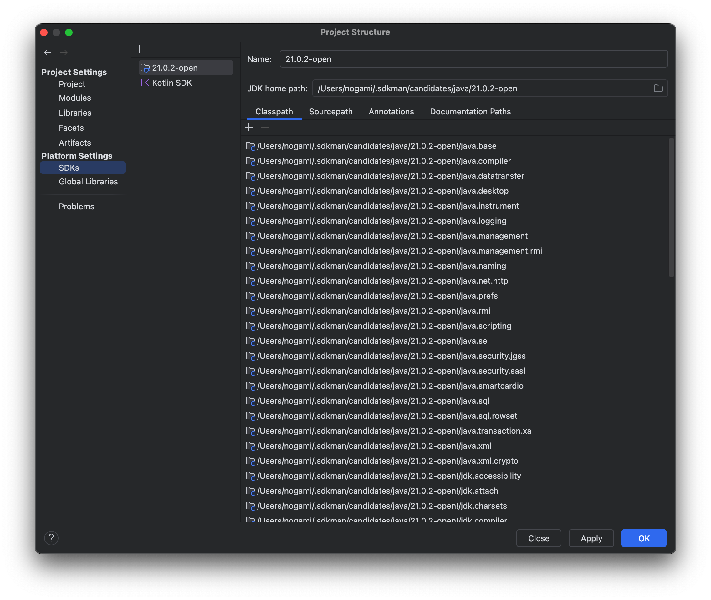
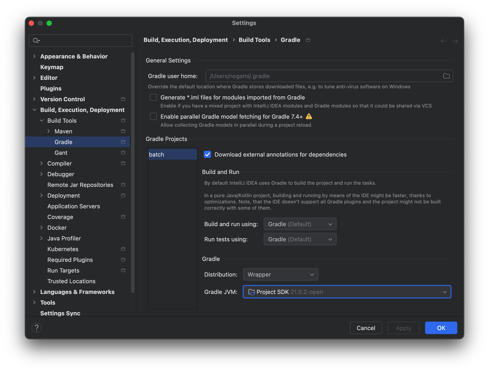
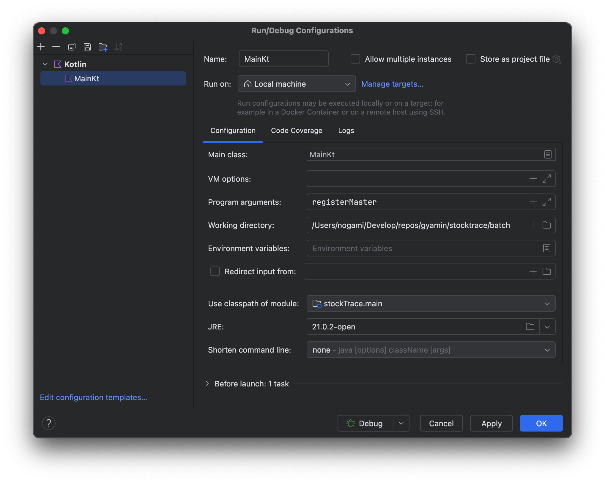

# 開発環境構築、アプリケーション実行

## 開発環境構築(Mac)

### インストール候補
```
% sdk list java

================================================================================
Available Java Versions for macOS ARM 64bit
================================================================================
 Vendor        | Use | Version      | Dist    | Status     | Identifier
--------------------------------------------------------------------------------
 Corretto      |     | 22.0.1       | amzn    |            | 22.0.1-amzn         
               |     | 21.0.3       | amzn    |            | 21.0.3-amzn         
               |     | 17.0.11      | amzn    |            | 17.0.11-amzn        
               |     | 11.0.23      | amzn    |            | 11.0.23-amzn        
...
```

### 特定バージョンインストール
```
% sdk install java 21.0.2-open
```

## IntelliJ 設定
gradleのjvmをsdkmanでインストールしたjdkに設定。これで、Run/Debugから実行ができようになる。




## ビルド

### 通常ビルド
- ./gradlew build
```
$ ce ~/Develop/stockTrace
$ ./gradlew build
  
> Task :test FAILED
  
MasterRegisterTest > testRegisterItemMaster$stockTrace() FAILED
    org.jdbi.v3.core.ConnectionException at MasterRegisterTest.kt:19
        Caused by: org.postgresql.util.PSQLException at MasterRegisterTest.kt:19
            Caused by: java.net.ConnectException at MasterRegisterTest.kt:19
```

### テストコードをスキップしてビルド
- ./gradlew build -x test
```
$ ./gradlew build -x test

BUILD SUCCESSFUL in 954ms
```

### ビルドされたファイル
```
$ ls -l build/libs/stockTrace-1.0-SNAPSHOT.jar 
-rw-r--r--  1 gyamin  staff  33714  4  1 01:02 build/libs/stockTrace-1.0-SNAPSHOT.jar
```

## 実行

`./gradlew run`
```
$ ./gradlew run

> Task :run FAILED
処理種別が指定されていません。
FAILURE: Build failed with an exception.

* What went wrong:
Execution failed for task ':run'.
> Process 'command '/Users/gyamin/.sdkman/candidates/java/16.0.1.hs-adpt/bin/java'' finished with non-zero exit value 9
...
```

#### gradleコマンドで実行
```
$ ./gradlew run

> Task :run FAILED
処理種別が指定されていません。
FAILURE: Build failed with an exception.

* What went wrong:
Execution failed for task ':run'.
> Process 'command '/Users/gyamin/.sdkman/candidates/java/16.0.1.hs-adpt/bin/java'' finished with non-zero exit value 9
...
```

#### jarファイルで実行
```
$ java -jar ./build/libs/stockTrace-1.0-SNAPSHOT.jar 
処理種別が指定されていません。
```

## jarファイルを実行するまでの苦労

### メイン・マニフェスト属性がありません
```
$ java -jar stockTrace-1.0-SNAPSHOT.jar 
stockTrace-1.0-SNAPSHOT.jarにメイン・マニフェスト属性がありません
```
build.gradle.kts に以下を追加(メインクラスを指定する)
```kotlin
tasks.jar {
    manifest {
        attributes["Main-Class"]= "MainKt"
    }
}
```

### java.lang.NoClassDefFoundError: kotlin/coroutines/Continuation
build.gradle.kts を以下のように設定
```kotlin
tasks.jar {
    duplicatesStrategy = DuplicatesStrategy.EXCLUDE
    manifest {
        attributes["Main-Class"]= "MainKt"
    }
    configurations["runtimeClasspath"].forEach { file: File ->
        from(zipTree(file.absoluteFile))
    }
}
```
