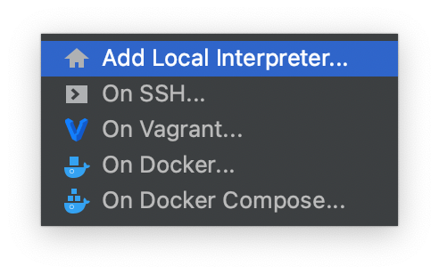
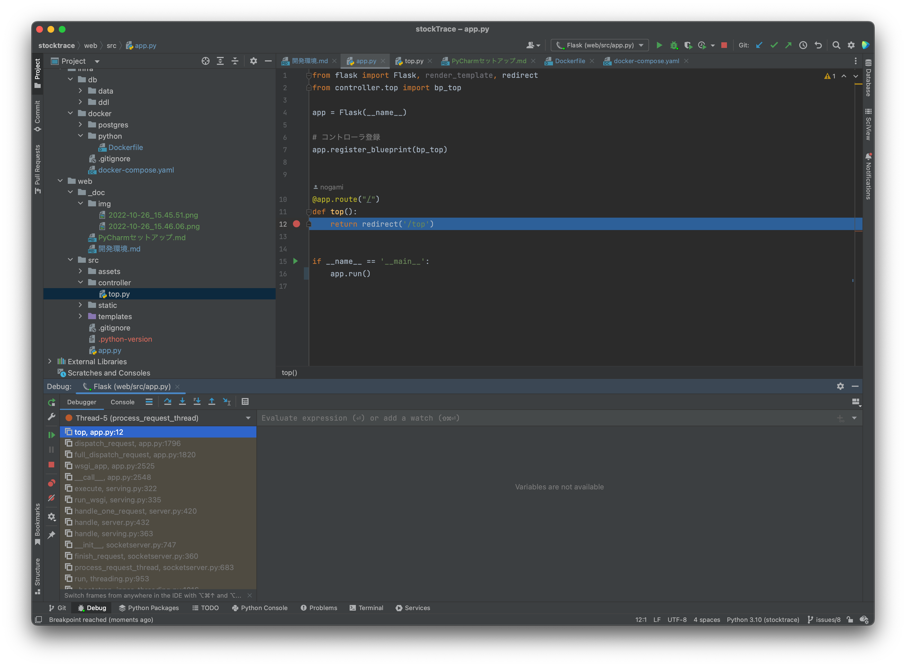
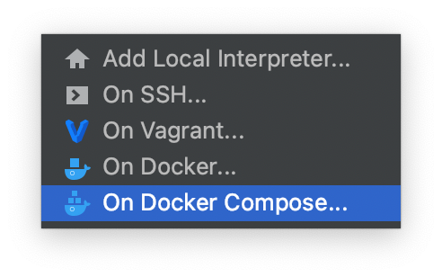
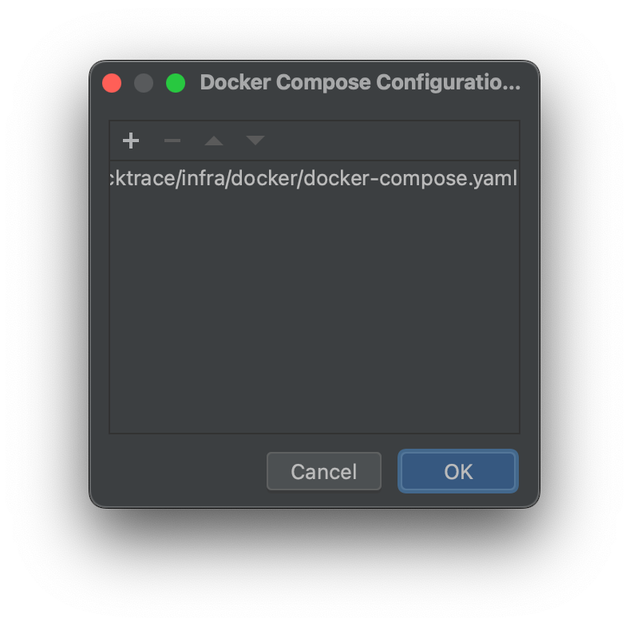
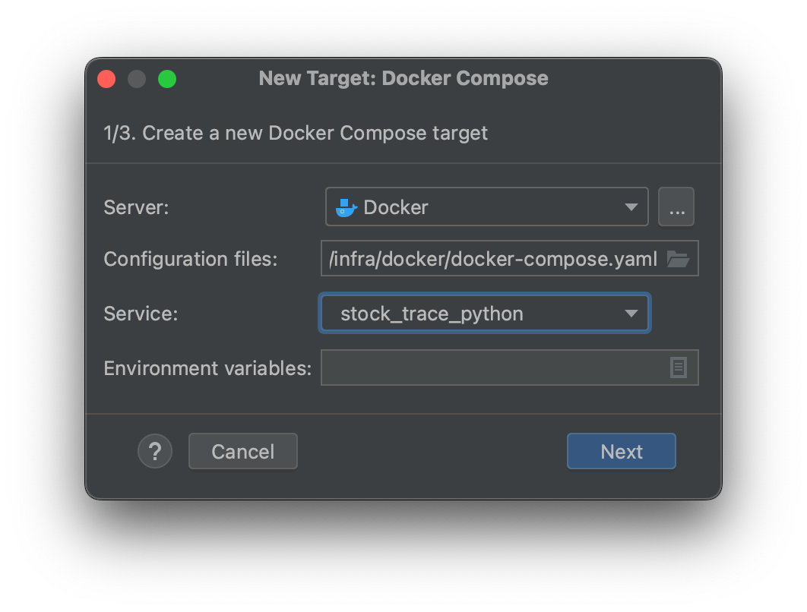
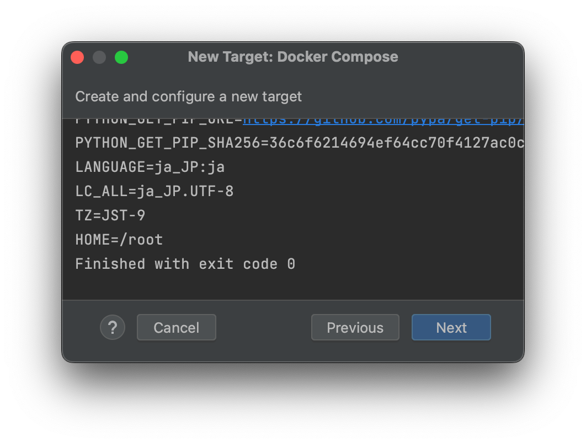
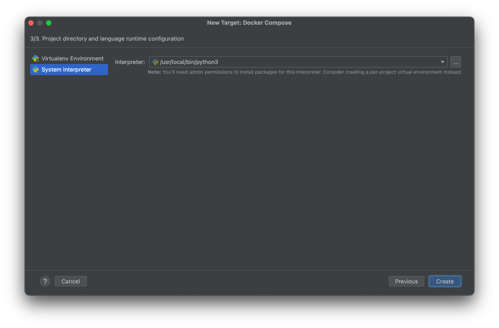
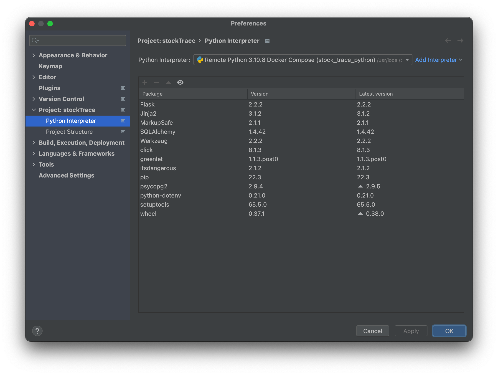
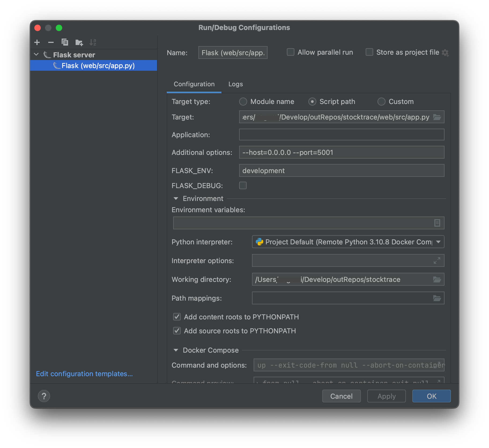
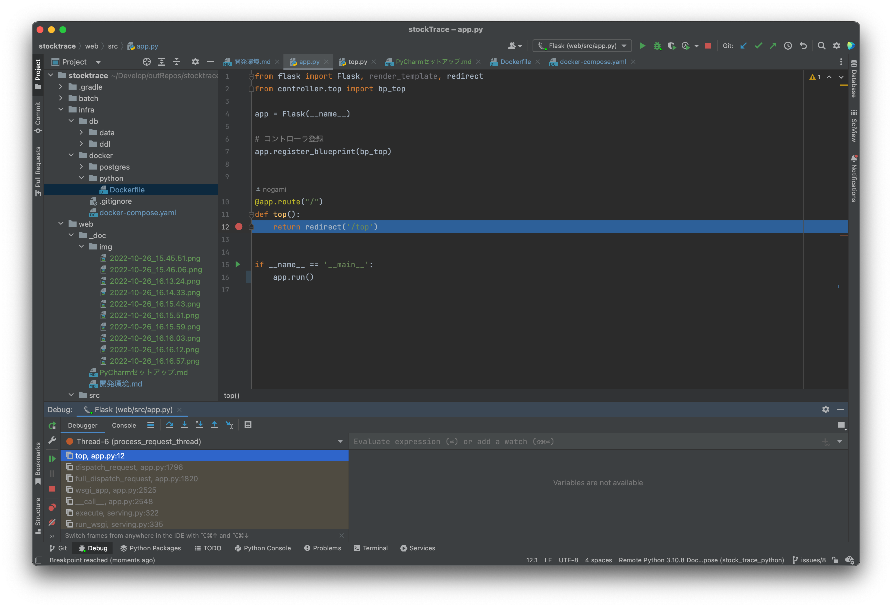

# PyCharmセットアップ

## インタープリタにpyenvを利用する
Preference > Project > Python Interpreter を開き、Add Interpreter から
Add Local Interpreterを選択する。


プロジェクトに作成した.venvディレクトリを指定


ブレークポイントを設定し、該当箇所を呼び出すとデバッグできる。


## インタープリタにDockerコンテナを利用する
Preference > Project > Python Interpreter を開き、Add Interpreter から
Add On Docker Compose... を選択する。


docker-compose.yml ファイルを指定する。


Serviceで対象のコンテナを選択する。



System Interpreterを選択すればいいみたい。


Dokcer Compose インタープリターが選択される。


Run/Debug設定でインタープリタに設定したコンテナを指定し、Additional Optionsでport設定をDockerfile設定と合わせる。


infra/docker/python/Dockerfile
```
...
WORKDIR /app
EXPOSE 5001
CMD ["python", "app.py"]
```

infra/docker/docker-compose.yaml
```
  stock_trace_python :
    container_name: stock_trace_python
    build: ./python
    volumes:
      - ./../../web/src:/app
    ports:
      - "5001:5001"
```

ブレークポイントを設定して、Debugを開始する。
